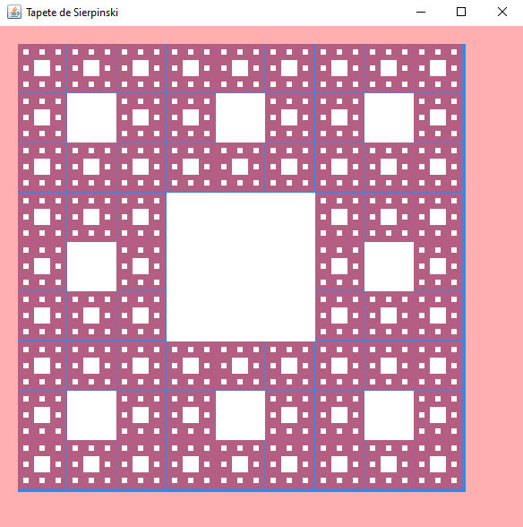

# Tapete de Sierpinski
<h2>Que es?</h2>

    
El tapete de Sierpinski es una figura geométrica fractal, creada a partir de un cuadrado, que sigue un proceso de repetición infinita similar a otros fractales como el triángulo de Sierpinski.

 
    <h3>Proceso de elaboaracion:</h3>
    <ul>
        <li>Empieza con un cuadrado sólido.</li>
        <li>Divide el cuadrado en 9 partes iguales, como si fuera una cuadrícula de 3x3, y elimina el cuadrado central.</li>
        <li>Repite este proceso para cada uno de los 8 cuadrados restantes (excepto el eliminado), dividiendo cada cuadrado en 9 partes y eliminando su parte central.</li>
        <li>Continúa este proceso infinitamente o hasta el número de iteraciones deseado..</li>
    </ul>

Imagen Generada con el Programa:

</img>

